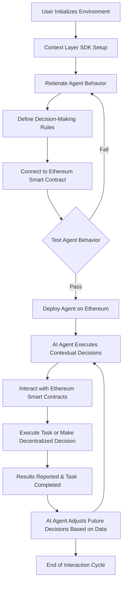

# Context Layer Documentation

Welcome to the **Context Layer** project documentation. This guide will help you understand the features, setup, and integration of the Context Layer platform. 

Context Layer is a decentralized platform that empowers AI agents to interact with Ethereum's blockchain, enabling context-aware decision-making. It provides a foundation for intelligent decentralized applications (dApps), where AI agents autonomously interact with blockchain data to make decisions and execute tasks.

## Table of Contents

- [Introduction](./introduction.md)
- [Core Features](./core-features.md)
- [Technical Architecture](./technical-architecture.md)
- [Quick Start Guide](./quick-start-guide.md)
- [Development Guide](./development-guide.md)
- [API Reference](./api-reference.md)
- [Security](./security.md)
- [Performance & Optimization](./performance-optimization.md)
- [Web3 Integration](./web3-integration.md)
- [Use Cases](./use-cases.md)
- [Contributing](./contributing.md)
- [FAQ](./faq.md)

## Social Links

Stay connected and follow us on:

- **Website**: [https://contextlayer.co](https://contextlayer.co)
- **X**: [x.com/contextlayereth](https://x.com/contextlayereth)
- **Telegram**: [t.me/contextlayer](https://t.me/contextlayer)

## Workflow Overview

Below is the high-level workflow of how the **Context Layer** platform functions, from building AI agents to deploying and interacting with Ethereum smart contracts.

## License

This project is licensed under the Apache License, Version 2.0 - see the [LICENSE](./LICENSE) file for details.
