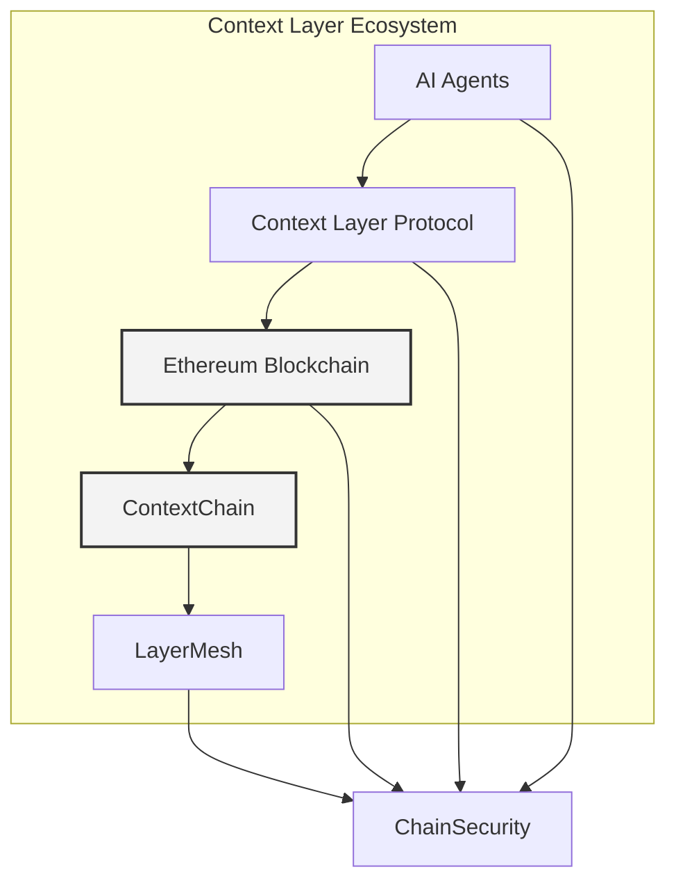

# Technical Architecture of Context Layer

The **Context Layer** platform is designed to seamlessly integrate artificial intelligence (AI) with blockchain technologies, specifically Ethereum (ERC20), to provide decentralized, context-aware systems. The technical architecture is composed of various interconnected components that work together to ensure real-time decision-making, efficient deployment, and robust security.

## 1. **System Overview**

The **Context Layer** platform is built upon several interconnected components that work together to enable intelligent, context-aware AI agents on the Ethereum blockchain. Below is the architecture of the system:

The architecture of **Context Layer** is based on a modular approach, which allows flexibility in development while ensuring scalability, security, and performance. The main components of the system include:

- **AI Agents**: Autonomous agents capable of making context-driven decisions based on blockchain data.
- **Context Layer Protocol**: A protocol that facilitates communication and decision-making for AI agents based on real-time blockchain data.
- **Ethereum Blockchain**: The underlying decentralized infrastructure that powers the system, using smart contracts and the Ethereum Virtual Machine (EVM).
- **ContextChain**: The integration layer that connects AI agents to the Ethereum blockchain, enabling secure interactions and real-time processing.
- **LayerMesh**: The decentralized infrastructure layer that ensures scalable and efficient deployment of AI models and agents.
- **ChainSecurity**: The security framework that guarantees the integrity of data and smart contracts within the platform.

---

## 2. **Components and Interaction**

The architecture consists of several key components that interact in a decentralized manner. Below is an overview of how each component works and how they interact with each other.

### 2.1 **AI Agents**
AI agents are the core entities within **Context Layer**. These autonomous agents interact with the blockchain, process real-time data, and make decisions based on the context of blockchain events. They can execute tasks, trigger smart contracts, and react to changes on the Ethereum network.

- **Task Automation**: AI agents automate tasks such as interacting with decentralized finance (DeFi) protocols, governance systems, or NFT marketplaces.
- **Decision-Making**: Agents make decisions based on real-time blockchain data, such as price fluctuations or governance votes.
- **Smart Contract Interaction**: AI agents can trigger smart contracts or other blockchain transactions based on their analysis of blockchain data.

### 2.2 **Context Layer Protocol**
The **Context Layer Protocol** enables communication between AI agents and the Ethereum blockchain. It acts as the interface that allows agents to process real-time blockchain data and make context-aware decisions.

- **Real-Time Data Processing**: The protocol processes live data from Ethereum, such as transactions, events, and smart contract updates.
- **Contextual Decision-Making**: The protocol enables agents to make informed decisions based on the context of blockchain data. For example, an agent might decide to trade an asset based on price movements or execute a governance proposal based on the outcome of a vote.

### 2.3 **Ethereum Blockchain**
The Ethereum blockchain provides the foundation for **Context Layer** by offering decentralized, immutable, and transparent infrastructure. The blockchain ensures the security and integrity of the platform’s transactions and smart contracts.

- **Smart Contracts**: Ethereum’s smart contracts serve as programmable scripts that execute predefined actions when certain conditions are met. AI agents interact with these smart contracts to trigger decentralized operations.
- **Decentralization**: The Ethereum blockchain is decentralized, providing resilience and reducing the risk of single points of failure.

### 2.4 **ContextChain**
**ContextChain** is the integration layer that connects AI agents to the Ethereum blockchain. It facilitates secure and efficient communication between the AI agents and Ethereum smart contracts, ensuring real-time interactions with minimal latency.

- **Blockchain Communication**: **ContextChain** ensures that AI agents can communicate directly with Ethereum smart contracts, send and receive transactions, and trigger actions on-chain.
- **Secure Data Exchange**: ContextChain secures the interaction between AI agents and smart contracts, ensuring that data exchanges are both transparent and tamper-proof.

### 2.5 **LayerMesh**
**LayerMesh** is the decentralized infrastructure layer that provides the necessary resources for deploying and running AI models on **Context Layer**. It ensures the scalability, reliability, and efficiency of the AI agents, enabling them to function smoothly within the Ethereum network.

- **Distributed Computing**: LayerMesh uses decentralized nodes to distribute the computational load of AI models, reducing costs and improving performance.
- **Scalability**: The decentralized nature of LayerMesh allows for the seamless scaling of AI models, accommodating increased workloads and ensuring that agents can operate at scale without performance degradation.
- **Fault Tolerance**: The decentralized architecture provides redundancy, ensuring high availability and fault tolerance of AI models deployed across the network.

### 2.6 **ChainSecurity**
**ChainSecurity** is the security framework that ensures the integrity and confidentiality of both the AI agents and Ethereum smart contracts. It offers robust security protocols for authentication, data encryption, and access control.

- **Authentication**: Secure authentication mechanisms, such as OAuth, ensure that only authorized users and agents can interact with the platform.
- **Data Encryption**: All data exchanged between AI agents and Ethereum is encrypted, both in transit and at rest, to prevent unauthorized access.
- **Access Control**: Fine-grained access control mechanisms prevent unauthorized actions on smart contracts and data sources, ensuring that only authorized agents can execute specific tasks.

---

## 3. **Inter-Component Flow**

To better understand how the components interact, here’s a simplified flow of data and actions within the system:

1. **AI Agent Creation**: A developer creates and trains an AI agent using the **ContextAI Lab**.
2. **Blockchain Data Consumption**: The agent starts interacting with real-time blockchain data through the **Context Layer Protocol**.
3. **Decision-Making**: Based on the processed data, the AI agent makes decisions. For example, an agent might decide to interact with a DeFi protocol based on a change in asset price.
4. **ContextChain Interaction**: The agent communicates with Ethereum smart contracts via **ContextChain**, sending transactions or triggering actions on-chain.
5. **Execution & Security**: The transaction is executed on Ethereum, and **ChainSecurity** ensures that the entire process is secure and transparent.

---

## 4. **System Scalability and Performance**

The **Context Layer** platform is built for scalability and high performance. By leveraging **LayerMesh**, the decentralized infrastructure ensures that AI agents can be deployed and scaled without compromising on performance. The platform’s architecture also supports optimization techniques, such as the use of layer-2 scaling solutions on Ethereum, to reduce costs and improve transaction throughput.

---

**Conclusion:**

The **Context Layer** technical architecture combines the power of artificial intelligence with blockchain technology to provide a robust and scalable platform for building decentralized, context-aware applications. The seamless interaction between components such as AI agents, the Ethereum blockchain, and decentralized infrastructure ensures that developers can build intelligent systems that operate in real time with full transparency and security.
